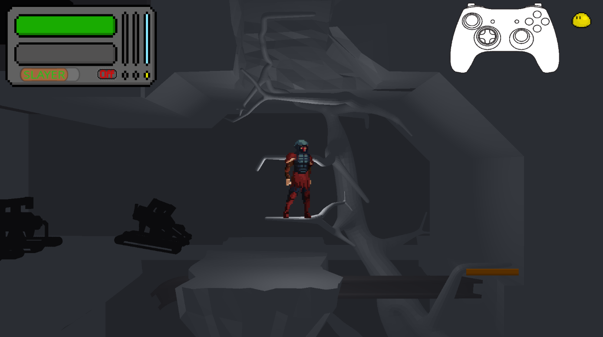

# ***Fading Light***

## Summary

Fading Light is a Metroidvania in the making made in Unity. You will play as Eldon, a Hunter trapped in a scientific facility 

## Gameplay

### Movement

As a metroidvania, Fading Light is a 2(.5)D  exploration game where you explore the NORA complex, fight the dreadful monsters known as Rejects or old security bots. You will also be able to find upgrades to move around more efficiently.

Implemented movement options are :
- Double Jump
- Wall grip
- Wall Jump
- 2 way zip line
- Grappling hook

### Combat

The main combat options are attacking, dodging, using gadgets and special skills. You can use them to deplete the Health or Energy Gauge of your enemies.

#### Health and Energy

You can kill an enemy by depleting its Health, but not only. If you manage to deplete your enemy's energy gauge, it opens them up for an execution, which kills them regardless of their remaining health. Some enemies have more Health than energy, and some the opposite. 

#### Gadgets

Gadgets use energy, which you can replenish using some equipements or attacking ennemies, and can do various effects, to attack, like a shockwave or grenade, for support like a small turret or for utility as a means of healing. Only one gadget can be equiped at all time

#### Grappling and hacking

You can move around by using grappling points, but you can also grapple enemies, which will bring them to you if their are small or you to them if they are not. If a mechanical unit is at grappling range with a depleted energy gauge, you can temporarily make them fight for you by hacking them.

#### Drones

You can equip up to two drones which follow you at all times. The drones can have a range of different effects, from passive health or energy regen to gunning down enemies. 

#### Slayer and Eater Modes

Eldon can switch between two modes which changes the damage type of his basic attack. Slayer mode reduces energy damage, but deals increased Health damage, while Eater mode deals more damage to the Energy gauge as well and restoring more of Eldon's own energy.

#### Using the chainsaw

Eldon's weapon is the chainsaw of his prosthetic arm. If he has energy, he can turn on its motor to deal increase damage at the cost of Energy. While in this mode, Eldon is stuck in Slayer Mode. The damage of drones and gadgets remains unchanged.

### Upgrades

Aside from fixed story upgrades (movement upgrades), Eldon can become stronger by equiping Augments which work similarly as Hollow Knight's charms, giving a variety of different effects. 

Eldon can also find merchants which can upgrade his gear and sell new gadgets, drones and augments.
